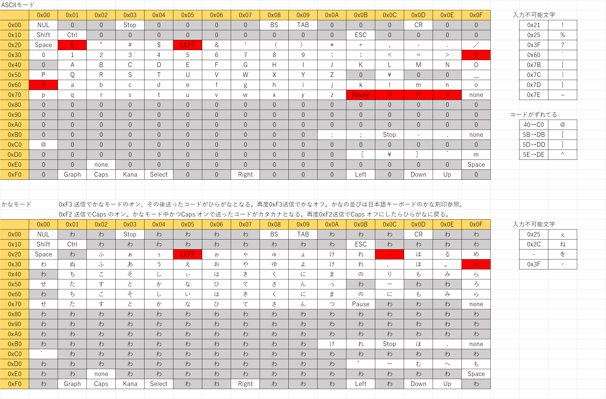

# msxterm  ver.0.2.2 (2023/04/10)

## msxterm とは

* msxterm とは PC から MSX0 に TCP/IP 接続するための専用ターミナルソフトです。
CUI で主にプログラム作成に使用する事を想定しています。
ＢＡＳＩＣでプログラムを組む際に色々便利な機能を内蔵しています。
* MSX0 の文字コードをフルにサポートしているので文字化けなどの問題が発生しません。

## 対応プラットフォーム

* CUI のコマンドラインから起動するようになっており、Windows、mac, Linux に対応します。
* Windows版、Mac版 のバイナリは Release ページからダウンロードしてください。
* Linux の方は各自でビルドしてください。
* 既知の問題としてWindows版の実行ファイルがウィルスと検知される場合があるようです。
    * https://github.com/akio-se/msxterm/issues/2
    * ツールの構造的にセキュリティーチェックには引っかかりやすい事になります。
    * セキュリティーを外してインストールするか、心配であればソースコードからビルドしてください。


### バイナリからインストールする場合

* zip を展開してパスの通った場所にコピーしてください。

### ソースコードからインストールする場合

* ビルドの際には rust のインストールが必要です。

* rust がインストール済みであれば下記の方法でOKです。

```
> git clone https://github.com/akio-se/msxterm.git
> cd msxterm
> cargo install --path ./
```

## 起動方法

* Mac、Linux の場合通常のシェルから実行します。
* Windows の場合コマンドプロンプトあるいは powershell から実行してください。

```
> msxterm -f history.txt 192.168.100.2:2223
```
* 引数として MSX0 の「IPアドレス:ポート番号」を指定して接続します。
* -f で「ヒストリファイル名」を指定します。
    * オプションを省略した場合、history.txt というファイル名になります。


### 文字の入力
* 通常のプロンプトが出ている状態で文字を入力します。
* Enter を押すと文字列がＭＳＸに送信されます。
* Enter を押すまではカーソルキーやコントロールキーで文字列が編集できます。
* 送信された文字列はヒストリに記録されます。カーソルの上下で過去のヒストリを呼び出せます。
* BASICであればこのヒストリで簡単にプログラムの修正ができます。

### プログラムの流し込み
* PC側のファイルをMSX0側にロードする機能があります。
* テキストのコピペにも対応しています。
* 複数行のテキストを貼り付けても一行ずつ分解されて MSX0 側に送られます。
* その際にヒストリにも一行ずつ登録されます。
* 流し込みの高速化のために文字を小文字に変換して送信します。(lowsend Mode)


### 特に覚えておいてほしいキー
* BASICのプログラムを停止するのは Ctrl-C となります。
* BASICのプログラムの Pause／解除 は Ctrl-D となります。 
* ターミナル側の画面のクリアは　Ctrl-L です。
* MSX側の画面のクリアは CLS 命令を使ってください。
* Ctrl-R で目的の行を探すのが便利だと思います。

### キーバインド詳細

基本的に Emacs 相当のバインドになっています。

| key      | action                       |
| -------- | ---------------------------- |
| Ctrl-A   | 行頭に戻る                     |
| Ctrl-B   | カーソル左                     |
| Ctrl-C   | Stop                         |
| Ctrl-D   | 一文字削除 / Pause             |
| Ctrl-E   | 行末へ移動                     |
| Ctrl-F   | カーソル右                     |
| Ctrl-G   | 検索キャンセル                  |
| Ctrl-H   | BackSpace                    |
| Ctrl-I   | TAB                          |
| Ctrl-J   | 改行                          |
| Ctrl-K   | カーソル位置から行末まで削除      |
| Ctrl-L   | 表示クリア                     |
| Ctrl-M   | 改行                          |
| Ctrl-N   | カーソル下                     |
| Ctrl-O   |                              |
| Ctrl-P   | カーソル上                     |
| Ctrl-Q   |                              |
| Ctrl-R   | インクリメンタル検索 後方        |
| Ctrl-S   | インクリメンタル検索 前方        |
| Ctrl-T   | 文字入れ替え                   |
| Ctrl-U   | カーソル位置手前を削除           |
| Ctrl-V   |                              |
| Ctrl-W   | スペースで区切られた単語単位で削除 |
| Ctrl-X-U | Undo                         |
| Ctrl-Y   | ヤンクバッファからペースト        |
| Ctrl-Z   | サスペンド (Linux)             |


# ターミナルコマンド

文字入力の先頭が # から始まる行は MSX0 側には送られずターミナル側のコマンドとして解釈されます。
## quit

```
> #quit
```

msxterm を終了します。

## hex

```
> #hex 40 6e 3c 0d
```

* スペースで区切られた2桁の16進数を ASCIIコードとして MSX0 側へ送信します。
* 現状の MSX0 のASCIIコードはかなり特殊なものとなっています。
* そのへんの検証用の機能と思ってください。

## load

```
> #load ./hello_world.bas
```

* PC側にあるテキストファイルのパスを指定します。
* それを読み込んで MSX0 側に送信します。
* 同時にターミナルのヒストリ、プログラムバッファにも登録されます。
* 空白を含むパスを指定する場合はダブルクォートで囲ってください。

```
> #load "c:\my file name"
```

## lowsend_on
小文字化送信モードをオンにします。起動時はデフォルトでオンになっています。
```
> #lowsend_on
```
ＢＡＳＩＣは基本的に大文字で入力をするのが普通なのですが、それを MSX0 に送る際に小文字に変換してから送信します。
なぜそんな事をするかというと通信の高速化のためです。現状のMSX0の場合、単純にいうと大文字は小文字を送信するより2倍遅いです。
ダブルクォートで囲まれた文字列などは変換しないのでプログラムの挙動には問題ないと思われます。何か問題があればお知らせください。

## lowsend_off
小文字化送信モードをオフにする。
```
> #lowsend_off
```
小文字化送信で何かトラブルが起きた場合はこれでオフにしてください。

## clear_history
* ヒストリバッファの履歴を全て消去します。
```
> #clear_history
```
何も聞かずに消すので気をつけて実行して下さい。

## dump_on
 MSX0からの文字出力をダンプモードにします。
 ```
 > #dump_on
 ```
* MSX0側の出力のデバッグ用の機能だと思ってください。
* 各文字のASCIIコードが16進数2桁で表示されます。

## dump_off
 MSX0からの文字出力をテキストモードへ戻します。
 ```
 > #dump_off
 ```

# プログラムバッファについて　
ターミナル側にはヒストリバッファとは別にプログラムバッファが存在します。
行の先頭から行番号がついた文字列はプログラムとみなしてプログラムバッファに溜めます。ターミナル側にプログラムのバックアップがある状態と思ってください。

## list

```
> #list
```

ターミナル側のプログラムバッファからlistを表示します。
引数で表示する範囲指定ができます。（MSXの仕様に倣って0～65530まで）
```
> #list 100-1000
```
100行目から1000行目まで表示します。

```
> #list -1000
```
先頭から 1000 行目まで表示。
```
> #list 1000-
```
1000行目から末尾まで

ターミナル側の　#list とMSX0側の list で見分けがつくように、暫定対応として行番号に色をつけています。

## save

```
> #save ./save_file.bas
```

* ターミナル側のプログラムバッファに登録されている内容を保存します。
* 空白を含むパスを指定する場合はダブルクォートで囲ってください。
* MSX0 側の内容とズレている場合があります。
* その場合、Reload で MSX0 側と同期をとります。（未実装）

## new
```
#new
```
プログラムバッファの中を消去します。
特に何も聞かずに消すので注意して下さい。

## dump_on


# ここから先未はまだ実装のコマンド

## reload_from

```
> #reload_from
```

* ターミナル側のプログラムバッファを破棄して MSX0側のプログラムを読み込みます。
* list 命令で表示している内容を取り込む形になるので途中で Ctrl-C などで止めないようにしてください。

## reload_to

```
> #reload_to
```

* MSX0側のプログラムをNEWしてターミナル側のプログラムバッファから読み込みます。
* リロードの向きを間違って消さないように気をつけてください。

# MSX0 の文字コードの問題について

現状の試作機では MSX0側の受信処理は M5 Faces Keyboard からの入力処理が流用されているようです。その為かなり特殊な文字コードとなっています。構造上どうしても送れない文字があります。



また、ターミナルから MSX0 に対しての送信がやたら遅く感じるかもしれませんが、keyboard入力をエミュレートする部分がウェイトを入れて同期を取っていて、それが1文字ずつ処理しているため遅いのだと思われます。
また、英数大文字やかなを受信したmsx0側では一文字ずつ Kana や Caps の状態切り替えをしているようにも見える為、余計に遅くなります。
そんなわけでプログラムは小文字で入力した方が早いです。
ここは MSX0側のシステムの問題なのでいつか改善されることを切に願います。


# 文字コードの流れ

## MSXへの入力側
```
msxterm(UTF-8) → (FacesKeybord Code) → MSX0 (MSX ASCII)
```

半角の入力不可文字は間違って入力してもプログラム的な害がないよう半角スペースに変換します。

```
! % ? ` { | } ~
```

ターミナル側で全角ひらがな・カタカナを入力すると、MSX ASCIIのひらがな・カタカナになって届きます。
ひらがな・カタカナ以外の全角文字は無視されます。入力不可のかな文字は近しい文字に変換されます。

| 元 | 後 |
| -- | -- |
| ぇ | え |
| ね | れ |
| を | お |
| ・ | 　 |


## MSXからの出力側
```
MSX0 (MSX ASCII) → msxterm (UTF-8)
```
出力側は特に大きな問題はないと思います。
ひらがな、カタカナなどはターミナル側では半角ではなく全角で表示されるようになっています。MSX特有のグラフィック文字も全角で表示されるように対応しています。


# ロードマップ
大まかな予定。
一般ユーザーにMSX0が届く7月までに ver.1.0 の正式リリースを目指す。 

* 0.1系　エディタなどの基本構造、Wifi TCP/IP接続の作成
* 0.2系　文字コード関連の対応全般
* 0.3系　USBケーブルでのシリアル接続に対応
* 0.4系　プログラムバッファ関連対応
* 0.5系　キー割り当ての調整
